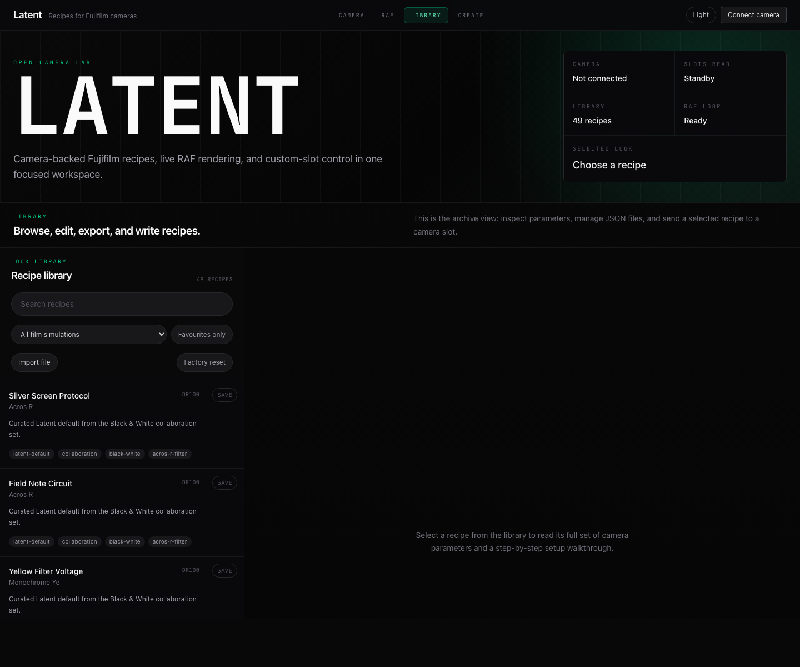
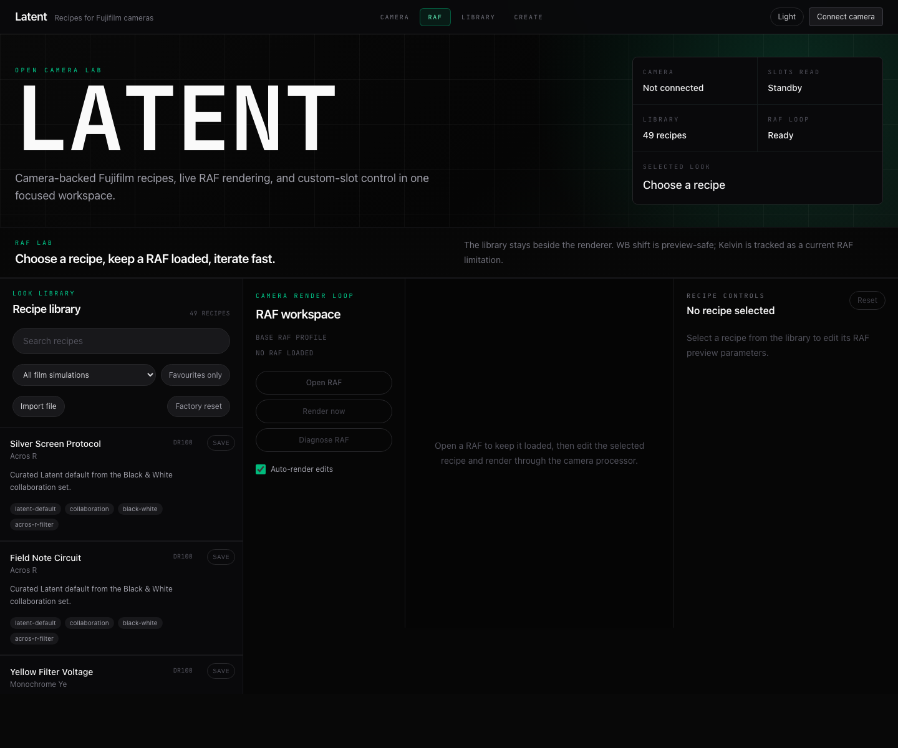
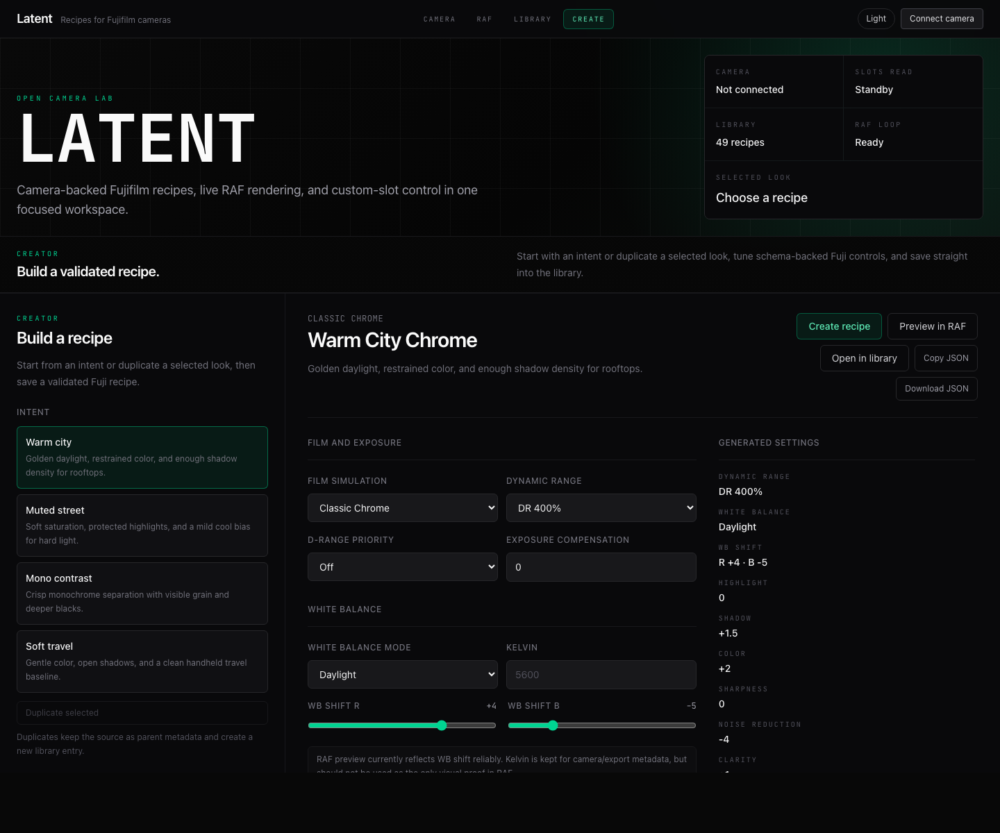
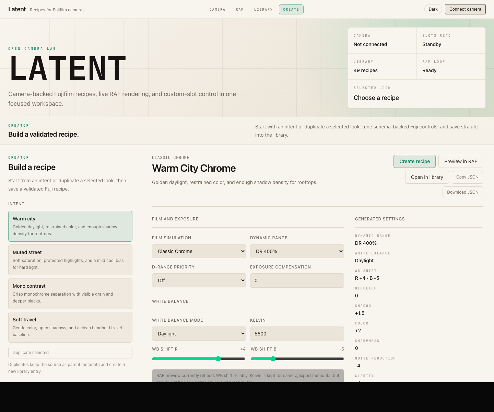
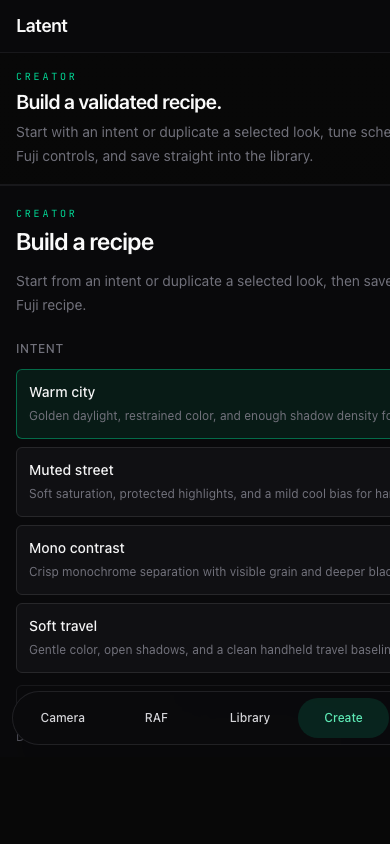

# Latent

Open-source camera-backed look lab for Fujifilm photographers. Latent lets
you keep a local recipe library, read and restore camera custom slots, render
RAF files through the camera processor, and iterate on a look with the real
Fujifilm pipeline instead of a browser approximation.

Latent is an independent fork and product expansion inspired by
[FilmKit](https://github.com/eggricesoy/filmkit). FilmKit proved that a
browser can manage Fujifilm presets and render RAF files through the camera
over WebUSB; Latent builds from that idea toward a broader open-source
workspace for recipe libraries, camera backups, connection reliability,
model capability tracking, and contributor-friendly protocol packages.

> **Status:** pre-launch, hardware-backed alpha. Core packages, WebUSB
> connection stability, recipe import/export, camera slot read/write, and RAF
> preview are implemented. See [`ROADMAP.md`](./ROADMAP.md) and
> [`PROGRESS.md`](./PROGRESS.md).
>
> Italian: see [`README.it.md`](./README.it.md).

Latent is for Fujifilm camera owners. It is **not affiliated with or endorsed
by Fujifilm Holdings Corporation**. "Eterna", "Velvia", "Provia", "Acros",
"Classic Chrome" and other simulation names referenced in recipes are
trademarks of their respective owners.

## What Latent Does Today

- **Recipe library:** browse, search, import, export, share links, delete,
  restore factory defaults, and keep everything local in the browser.
- **Recipe creator:** start from photographic intents, duplicate an existing
  look with parent metadata, edit schema-backed Fujifilm settings, and export a
  validated JSON recipe without connecting hardware.
- **Camera connection:** connect over WebUSB in Chromium browsers, recover
  from refresh/unplug/camera sleep, and surface macOS claim-collision guidance.
- **Custom slots:** read camera-side C1-C4 recipes, import them into the
  library, and write verified recipe fields back to a chosen slot.
- **RAF preview:** send a local RAF file to the connected camera, render the
  selected recipe through the camera image processor, and diagnose parameter
  groups when a look does not match expectation.
- **Schema and protocol packages:** use MIT-licensed packages for recipe
  validation, capability-aware translation, PTP framing, WebUSB transport, and
  connection state management.

## Screenshots

| Library workspace                                                                        | RAF preview                                                                       |
| ---------------------------------------------------------------------------------------- | --------------------------------------------------------------------------------- |
|  |  |

| Recipe creator, dark                                                                            | Recipe creator, light                                                                             |
| ----------------------------------------------------------------------------------------------- | ------------------------------------------------------------------------------------------------- |
|  |  |

| Mobile creator                                                                         |
| -------------------------------------------------------------------------------------- |
|  |

## Why It Exists

Most recipe tools are static forms: you copy settings by hand and hope the
camera produces the expected result. Latent treats the camera as the rendering
engine. The goal is a workflow where a photographer can:

1. Back up the custom slots already on the camera.
2. Import or design recipes locally.
3. Preview a recipe against a known RAF using the camera processor.
4. Write a verified recipe to a disposable slot.
5. Restore the original slot if the experiment is not right.

## Relationship To FilmKit

Latent is not meant to compete with FilmKit. It exists because FilmKit's
WebUSB/PTP work made the path credible, and because there is room for a
community project with a different emphasis.

What differs today:

- **Workflow safety:** Latent makes backup, read-back, restore, and explicit
  slot writes first-class flows.
- **Connection reliability:** Latent adds a dedicated connection manager,
  structured error classification, reconnect behavior, and macOS PTP
  claim-collision guidance.
- **Package boundaries:** protocol, WebUSB transport, connection management,
  and recipe schema live in separate `@latent/*` packages.
- **Schema discipline:** recipe fields, camera capabilities, translators, and
  round-trip tests are kept in lockstep by CI.
- **Open-source onboarding:** docs, use cases, hardware QA, governance, issue
  templates, and launch checklist are part of the repo.
- **Validation target:** current hands-on validation has focused on X-S20 and
  X-M5, while FilmKit documents X100VI as its primary tested body.

Where Latent should go next:

- richer recipe editing with auto-render, closer to FilmKit's fast creative
  loop;
- broader camera compatibility reports from the community;
- safer verified writes for more camera-specific fields;
- a public library workflow for importing, comparing, and sharing recipes;
- eventually, native transport support when WebUSB becomes the limiting factor.

## Quick Start

```bash
nvm use                   # Node 22, pinned by the repo
npm install
npm run validate          # typecheck + lint + tests + license + lockstep
npm run dev:macos         # Web app + local macOS camera helper
```

Open `http://127.0.0.1:5173/` in Chrome, Edge, or Arc. WebUSB works only on
`localhost` or HTTPS. The recipe library works without hardware; camera flows
need a Fujifilm body set to USB/PTP mode.

`npm run dev:macos` starts the two local processes needed for hardware-backed
macOS development:

- `http://127.0.0.1:5173/` - Vite web app.
- `http://127.0.0.1:5174/` - local macOS camera helper.

The helper is intentionally local. Browsers cannot run `launchctl`, suspend
`ptpcamerad`/`icdd`, or restore macOS camera services on their own, so Latent
uses a localhost helper to expose explicit Release and Restore actions in the
app. Stop the stack with `Ctrl+C`; if you released macOS camera services during
testing, use the in-app Restore control before disconnecting.

For browser-only work that does not need camera service control, you can still
run the app directly:

```bash
npm --workspace @latent/web run dev -- --host 127.0.0.1
```

## Hardware Notes

Development has been exercised with Fujifilm X-S20 and X-M5 bodies. Other
recent X-series cameras may work, but should be treated as unverified until
someone runs the hardware checklist.

Before writing to a camera:

- Import the existing slot into the library first, so you can restore it.
- Choose a disposable custom slot. Do not overwrite your only copy of an
  important look.
- Keep the camera awake and connected directly by USB when possible.
- On macOS, close Image Capture, Photos, X RAW Studio, and any app that may
  claim the PTP interface.

Manual release checks live in
[`docs/qa/hardware-test-plan.md`](./docs/qa/hardware-test-plan.md). macOS
Image Capture/WebUSB release notes live in
[`docs/qa/macos-webusb-camera-release.md`](./docs/qa/macos-webusb-camera-release.md).

## Use Cases

Detailed flows live in [`docs/use-cases.md`](./docs/use-cases.md). The short
version:

- **Back up my camera recipes:** connect, read slots, import each custom slot
  into the local library, export JSON if needed.
- **Try a recipe on a known RAF:** open the RAF workspace, select a recipe,
  render, adjust preview-only controls, and compare diagnostic variants.
- **Create a recipe from scratch:** open the Creator workspace, choose an
  intent or duplicate a selected look, tune the Fuji controls, then save the
  result into the local library or export JSON.
- **Write a recipe to camera:** select a library recipe, write to C1-C4, then
  verify by reading the slot back.
- **Recover from a bad write:** select the previously imported backup recipe
  and write it back to the same slot.

## Repo Map

| Path                         | What it is                                                                           |
| ---------------------------- | ------------------------------------------------------------------------------------ |
| `apps/web`                   | AGPL web app: library, camera panel, RAF workspace, bilingual EN/IT UI               |
| `packages/camera-connection` | Connection manager, state machine, classifier, and WebUSB camera driver              |
| `packages/recipe-schema`     | Zod recipe schema, camera capability matrix loader, migrations, diff and translators |
| `packages/ptp-fuji`          | MIT PTP protocol layer for Fujifilm cameras, forked from filmkit with attribution    |
| `packages/ptp-fuji-webusb`   | WebUSB transport implementing the PTP transport boundary                             |
| `packages/ai-agent`          | Future AI helper package; currently a stub                                           |
| `data/`                      | Camera model capability data and bundled seed recipes                                |
| `docs/`                      | Specs, execution plans, ADRs, use cases, QA, and review transcripts                  |

## Development Commands

```bash
npm run typecheck
npm run lint
npm run test
npm run license-check
npm run lockstep-check
npm run validate
```

Adding a recipe field must update schema, camera capabilities, translator,
and round-trip tests together. `npm run lockstep-check` enforces this.

## Privacy And Safety

- Recipes and RAF files stay local unless the user explicitly exports or
  uploads something elsewhere.
- WebUSB access is gated by the browser picker and the app's Fujifilm vendor
  filter.
- Camera writes require an explicit slot button click.
- Preview-only fields such as exposure compensation and D Range Priority are
  rendered through the RAF flow but are not written to custom slots until the
  camera write path is verified.
- Security issues should be reported privately; see [`SECURITY.md`](./SECURITY.md).

## Contributing

Start with [`CONTRIBUTING.md`](./CONTRIBUTING.md), then read
[`docs/onboarding.md`](./docs/onboarding.md). The roadmap is intentionally
narrow because camera write paths need careful hardware validation.

## Funding

Latent is open source and has no paid features. If it saves you time or you
want to support hardware testing, you can contribute through
[Buy Me a Coffee](https://buymeacoffee.com/galbrizio).

## License

- **App** (`apps/*`): [AGPL-3.0](./LICENSE). If you run a modified Latent app
  as a network service, publish the corresponding source.
- **Libraries** (`packages/*`): MIT. They are designed to be reusable outside
  this app.

The split is intentional: the community-facing app stays open, while the
underlying protocol and schema libraries remain broadly reusable.

## Acknowledgements

- [filmkit](https://github.com/eggricesoy/filmkit), whose PTP work made
  `packages/ptp-fuji` possible
- rawji, fudge, libgphoto2, ISO 15740, and the Fujifilm reverse-engineering
  community for the protocol trail
- The X-Series photographers testing real bodies, real recipes, and real
  failure modes
- [Formray](https://formray.io), the studio Latent is built inside

---

_Latent. Develop the image you did not know you had._
